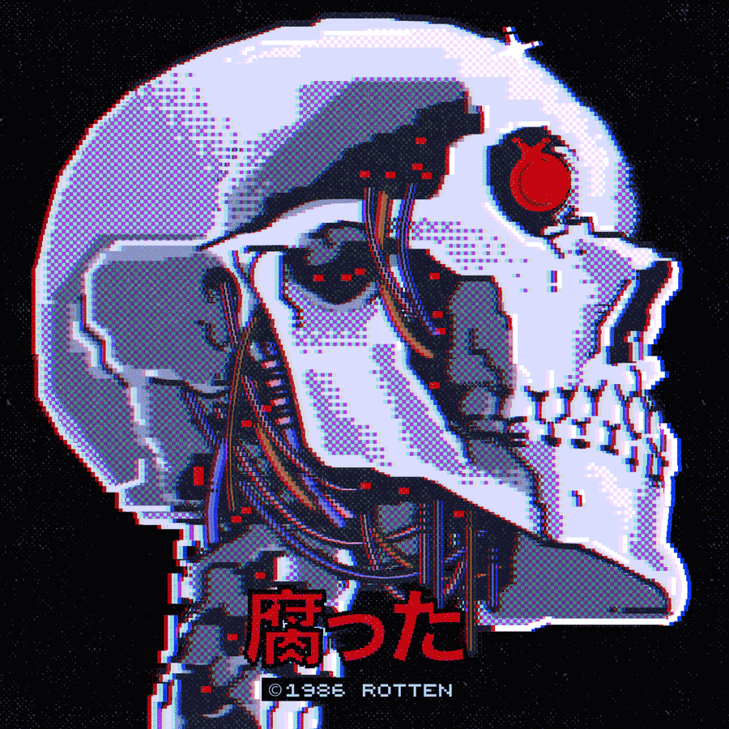

# About Me

I am <mark style="color:purple;">`{carnifex17}`</mark>, pizza fan, cybersecurity student, ethical hacker, and just a good guy. I am active on platforms like [<mark style="color:green;">**Hackthebox**</mark>](https://app.hackthebox.com/profile/637180) and [<mark style="color:blue;">**TryHackMe**</mark>](https://tryhackme.com/p/carnifex17) and member of [<mark style="color:purple;">**purplestorm**</mark>](https://discord.gg/purplestorm) team. Here you could find my notes, interesting and useful things and also here would be my portfolio later.

***

<figure><figcaption>
Awesome art from <strong>Manuel Cetina</strong><a href="https://www.behance.net/elstitch"> <strong>[LINK]</strong></a>
</figcaption></figure>
