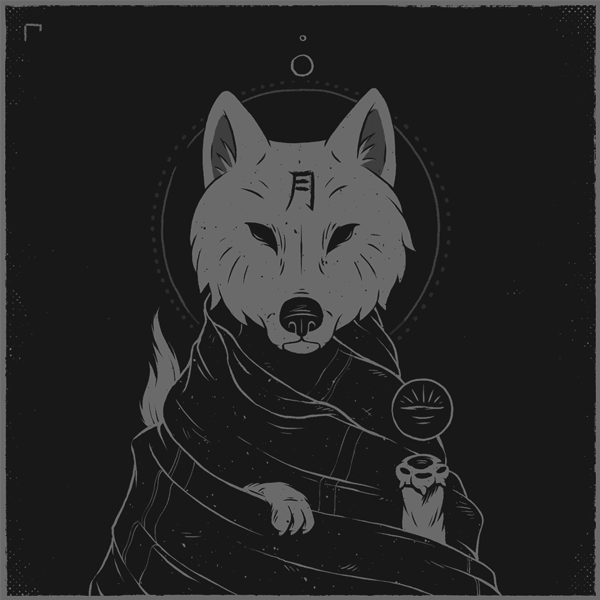

# About Me

I am <mark style="color:purple;">`{carnifex17}`</mark>, pizza fan, cybersecurity student, ethical hacker, and just a good guy who's motivated to become the best version of himself. I am active on platforms like [<mark style="color:green;">**Hackthebox**</mark>](https://app.hackthebox.com/profile/637180) and [<mark style="color:blue;">**TryHackMe**</mark>](https://tryhackme.com/p/carnifex17) and member of [<mark style="color:purple;">**purplestorm**</mark>](https://discord.gg/purplestorm) team. Here you could find my notes, interesting and useful things.

***

<figure><figcaption>
<em><mark style="color:purple;"><strong>Greatness is a metal forged by strength, will and knowledge</strong></mark></em>
</figcaption></figure>
