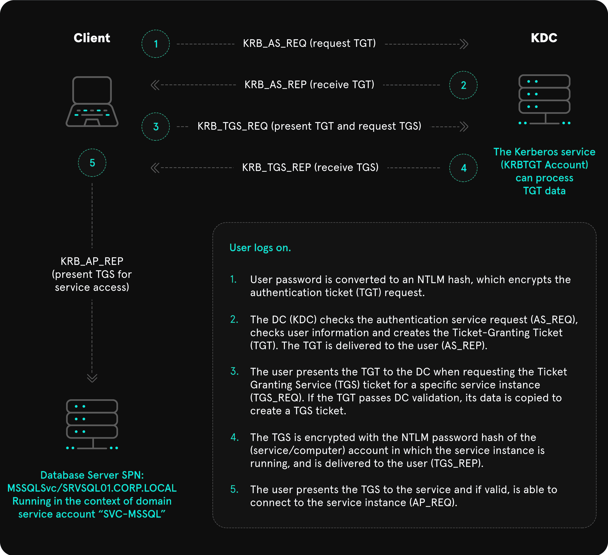
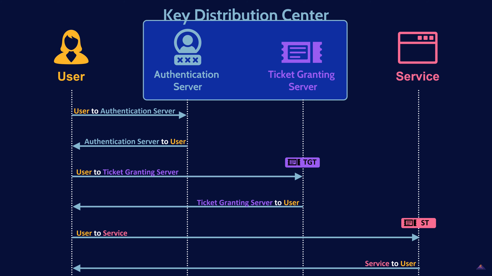

# Theory

## What is Active Directory

<mark style="color:red;">**Active Directory (AD)**</mark> is a directory service developed by **Microsoft** for Windows domain networks. It is included in most Windows Server operating systems as a set of processes and services. Active Directory plays a crucial role in managing the identities and relationships that make up network environments. Active Directory hacking is very complex topic

### Key Concepts of Active Directory

* <mark style="color:red;">**Domain**</mark><mark style="color:red;">:</mark> The basic unit of structure in an Active Directory network. A domain is a collection of objects such as users, groups, and computers that are managed centrally.
* <mark style="color:red;">**Forest**</mark><mark style="color:red;">:</mark> A collection of one or more domain trees. Forests enable global policies and trust relationships across multiple domains.
* <mark style="color:red;">**Tree**</mark><mark style="color:red;">:</mark> A hierarchy of domains in Active Directory that share a contiguous namespace.
* <mark style="color:red;">**Organizational Unit (OU)**</mark><mark style="color:red;">:</mark> A container within a domain that can hold users, groups, computers, and other OUs. OUs allow the organization of objects within a domain and the application of policies at a granular level.
* <mark style="color:red;">**Global Catalog**</mark><mark style="color:red;">:</mark> A distributed data repository that contains a searchable, partial representation of every object in every domain within a forest. It is used to improve query performance and facilitate logon processes across domains.

After Windows system became part of the domain, it's interaction with SAM is over, they've broke up and it's new boyfriend is Domain Controller. And all questions about checking password would now be sent to Domain Controller, not SAM.  But in some ways system could come over to SAM if specify the `hostname` of the device proceeded by the `username` like <mark style="color:blue;">**WS01/nameofuser**</mark>**.**&#x20;

## Kerberos

<mark style="color:red;">**Kerberos**</mark> is default domain accounts authentication protocol since **Windows 2000**. Main difference between other authentication protocols is that **Kerberos** use tickets, instead of just transmitting passwords all over the network. This image will show you simplified version of **Kerberos** authentication process, and then I'll explain everything in parts. Also for more detailed explanations I could recommend to watch [**\[THIS\]**](https://youtu.be/5N242XcKAsM?t=870) video.

<figure><figcaption></figcaption></figure>

The whole **ping-pong** of tickets and requests is shows here:

<figure><figcaption>
Image is from video above
</figcaption></figure>

### Main Kerberos Terms

*   **Key Distribution Center (KDC)**:

    Core of **Kerberos** authentication that manages secret keys and distributes them to clients and servers. It is divided into two main components: the <mark style="color:red;">**Authentication Server (AS)**</mark> and the <mark style="color:red;">**T**</mark><mark style="color:red;">**icket Granting Server (TGS)**</mark>.
*   **Authentication Server (AS)**:

    Part of the **KDC** that verifies the identity of the client. Upon successful authentication, it issues a <mark style="color:red;">**Ticket Granting Ticket (TGT)**</mark> to the client, which can be used to request service tickets from the **TGS**. There are also database with hashes of user credentials.
*   **Ticket Granting Server (TGS)**:

    Part of the **KDC** that issues service tickets to clients that have a valid **TGT**. These service tickets allow the client to authenticate to various services without needing to re-enter their credentials. There are also database with service secret keys, which is used to <mark style="color:green;">**encrypt/decrypt**</mark> **service tickets**.
*   **Ticket Granting Ticket (TGT)**:

    Ticket given by the **AS** to a client upon successful authentication. It contains a session key and is used to obtain service tickets from the **TGS**. The **TGT** is encrypted with the **TGS's** secret key.
* **Service Ticket:** \
  This **Ticket** allows a client to authenticate to a specific service. It contains encrypted information that verifies the client's identity and includes a session key that the client can use to communicate securely with the service.

## NTDS.DIT

<mark style="color:red;">**NTDS.DIT**</mark> stands for <mark style="color:red;">**New Technology Directory Services Directory Information Tree**</mark>. It is main database file within Microsoft’s <mark style="color:red;">**Active Directory Domain Services**</mark> (AD DS). **NTDS.DIT** stores and organizes all the information related to objects in the domain, including **users**, **groups**, **computers**, and more. It acts as the backbone of Active Directory, housing critical data such as **user account details**, **passwords**, **group memberships**, and other **object attributes**.

***

## Important Files Location

* <mark style="color:green;">**%systemroot%/ntds**</mark>** **_**- Location of NTDS.dir file**_

