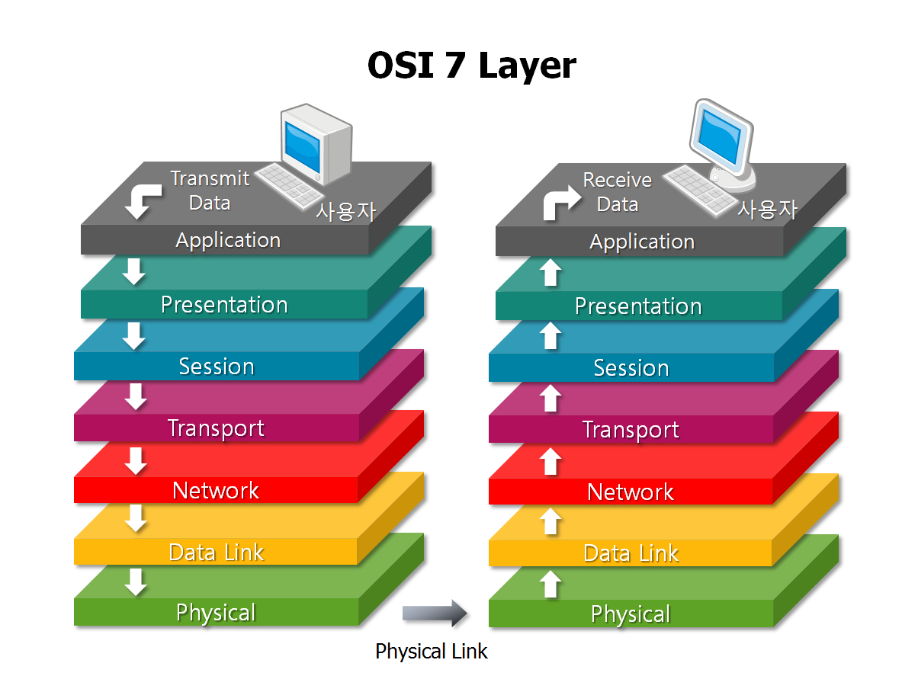
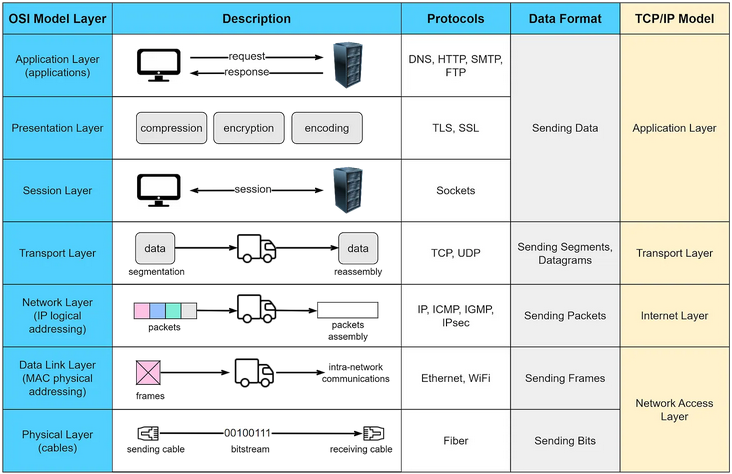

# OSI Model

**The `OSI` (Open Systems Interconnection) model is a conceptual framework that standardizes the functions of a telecommunications or networking system into seven distinct layers:**

***

1. `Physical Layer`: This layer deals with the physical medium and hardware aspects of data transmission, such as cables, switches, and electrical signals.
2. `Data Link Layer`: Responsible for the reliable transmission of data over a physical medium, it handles tasks like addressing, error detection, and framing.
3. `Network Layer`: Focuses on routing and forwarding data packets between different networks, often using logical addressing (like IP addresses).
4. `Transport Layer`: Ensures end-to-end data transfer reliability and provides services like flow control, error detection and correction, and data segmentation.
5. `Session Layer`: Manages the establishment, maintenance, and termination of communication sessions between devices, allowing for synchronization and organization of data exchange.
6. `Presentation Layer`: Responsible for data translation, encryption, and compression, making sure data is in a format that can be understood by both sender and receiver.
7. `Application Layer`: This is the topmost layer that interacts with end-user applications and provides network services like email, web browsing, and file transfer.

***

_But I think in this topic pictures are better explainers:_&#x20;

<figure><figcaption></figcaption></figure>

<figure><figcaption></figcaption></figure>

***
