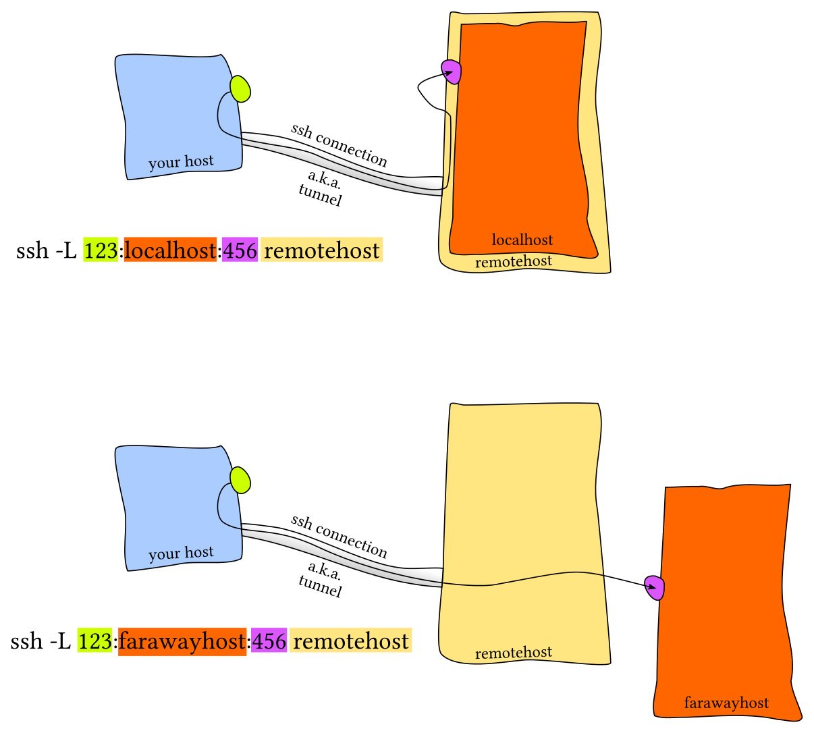
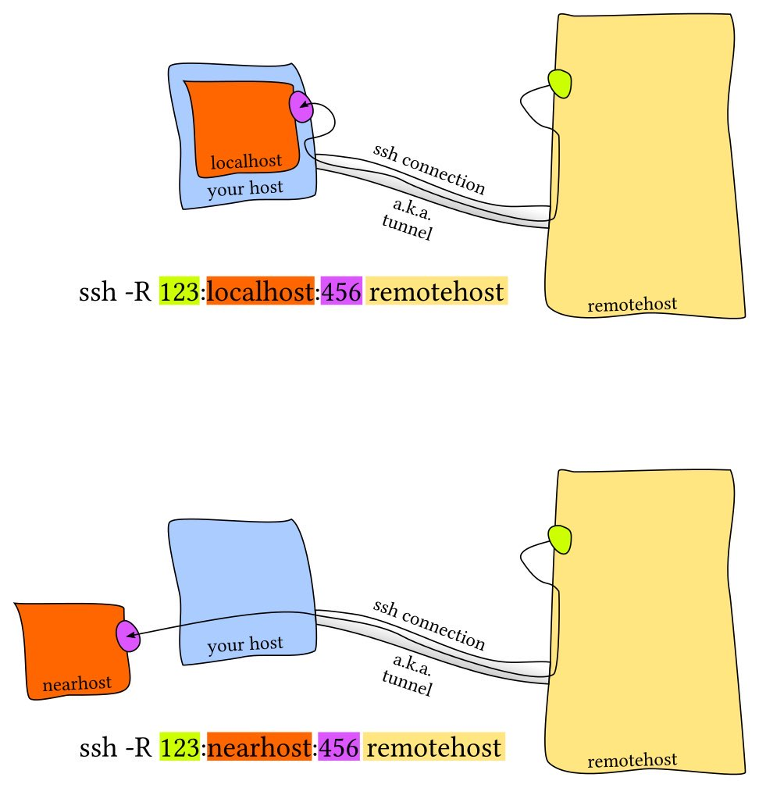

# Theory

## SSH Tunneling

* `SSH Tunneling` - is a mechanism that allows you to securely transfer data over an unsecured network by encrypting and securing the connection between two points.\
  `SSH (Secure Shell)` - is a protocol for secure remote computer operation and data transfer, and it is used to create these secure tunnels. Mostly we could do the same things with local and reverse tunneling, but it depends which things we are controlling, remote server or local computer. Also to not be confused, you should always remember that "local" is subjective term.\* Also [this](https://youtu.be/AtuAdk4MwWw?si=85DZ-shYuHFJIqX2) video explains very well this topic

***

The main types of SSH Tunneling include:

1. **`Local Port Forwarding`**: This type of tunneling allows you to pass traffic between your local computer and a remote server over SSH. So shortly we just communicate to some remote service, but in system level all requests to remote server will come through our our local port. It is pretty useful if we want to communicate to remote database as it is our local database. Useful stuff

<figure><figcaption><p>Local Port Forwarding</p></figcaption></figure>

```bash
ssh -L local_port:destination_address:destination_port username@remote_server
```

***

2. **`Remote or Reverse Port Forwarding`**: In this case, the remote server is used to transfer traffic from the remote port to the local computer.

<figure><figcaption><p>Remote Port Forwarding</p></figcaption></figure>

```bash
ssh -R remote_port:localhost:local_port username@local_machine_ip
```

3. **`Dynamic Port Forwarding`**: This type of tunneling allows you to create a "proxy" on a remote server through which you can route traffic from your local computer through the remote server to various Internet resources. This is especially useful when you need anonymous access to the Internet or when you need to bypass network restrictions.

```bash
ssh -D local_socks_port username@remote_server
```

## Network Sockets

<mark style="color:red;">**Socket**</mark> - is one <mark style="color:purple;">**endpoint**</mark> of a two way communication link between two programs running on the network. Sockets have two main states: They are either <mark style="color:yellow;">**connected**</mark> and facilitating an ongoing network communication, or they are <mark style="color:yellow;">**waiting**</mark> for an incoming connection to connect to them. The listening socket is called the server, and the socket that requests a connection with the listening socket is called a client. You could use **netstat** command to manage and discover your own sockets, for what and where are they used. The "Active Internet" section lists the network connections that are (or will be) established to external devices. The "UNIX domain" section lists the connections that have been established within your computer between different applications, processes, and elements of the operating system.

***

**TCP Socket States**

| Socket State   | Explanation                                                                                                                |
| -------------- | -------------------------------------------------------------------------------------------------------------------------- |
| `LISTEN`       | Servers-side. Socket waiting for a connection request                                                                      |
| `SYN-SENT`     | Client-side. Socket has made a connection request and wait.                                                                |
| `SYN-RECEIVED` | Server-side. Socket is waiting for a connection ack after accepting request                                                |
| `ESTABLISHED`  | Server and Client. A working connection has been established between the server and the client, allowing for data transfer |
| `FIN-WAIT-1`   | Server and Client. Socket is waiting for a termination request or for ack of previous termination request                  |
| `FIN-WAIT-2`   | Server and Client. Socket is waiting for a termination request                                                             |
| `CLOSE-WAIT`   | Socket is waiting for a termination request ack from local user                                                            |
| `CLOSING`      | Server and Client. Socket is waiting for a termination request ack from remote socket                                      |
| `LAST-ACK`     | Server and Client. Socket is waiting ack of termination from remote socket                                                 |
| `TIME-WAIT`    | Server and Client. Server and Client. Checking if termination ack was received                                             |
| `CLOSED`       | No connection, socket is terminated                                                                                        |

***

## DMZ

**`DMZ`, or Demilitarized Zone, in the context of computer networks, is a segregated area that acts as a buffer between a trusted internal network and an untrusted external network, such as the internet. It typically contains servers that need to be accessible from the internet. like web servers or email servers. The `DMZ` helps enhance security by isolation these servers from the internal network, by reducing the risk of unauthorized access to sensitive information.**

## SSL

**`SSL`, or Secure Sockets Layer, is an encryption-based Internet security protocol. It was first developed by Netscape in 1995 for the purpose of ensuring privacy, authentication, and data integrity in Internet communications. SSL is the predecessor to the modern TLS encryption used today.**

***

### What is an `SSL` certificate?

`SSL` can only be implemented by websites that have an SSL certificate (technically a "TLS certificate"). An `SSL` certificate is like an ID card or a badge that proves someone is who they say they are. `SSL` certificates are stored and displayed on the Web by a website's or application's server.

One of the most important pieces of information in an `SSL` certificate is the website's public key. The public key makes encryption and authentication possible. A user's device views the public key and uses it to establish secure encryption keys with the web server. Meanwhile the web server also has a private key that is kept secret; the private key decrypts data encrypted with the public key.

***

### What are the types of SSL certificates?

There are several different types of SSL certificates. One certificate can apply to a single website or several websites, depending on the type:

***

* `Single-domain`: A single-domain `SSL` certificate applies to only one domain (a "domain" is the name of a website, like www.cloudflare.com).

***

* `Wildcard`: Like a single-domain certificate, a wildcard SSL certificate applies to only one domain. However, it also includes that domain's subdomains. For example, a wildcard certificate could cover www.cloudflare.com, blog.cloudflare.com, and developers.cloudflare.com, while a single-domain certificate could only cover the first.

***

* `Multi-domain`: As the name indicates, multi-domain SSL certificates can apply to multiple unrelated domains.

***

## OpenSSL

**`OpenSSL` is a widely-used open-source toolkit for implementing the `SSL (Secure Sockets Layer)` and `TLS (Transport Layer Security)` protocols. It provides a set of cryptographic functions and utilities that enable secure communication over a computer network. `OpenSSL` is commonly used for creating and managing `SSL/TLS` certificates, generating cryptographic keys, and performing various cryptographic operations.**

***

**Here are some basic and common OpenSSL commands on Linux:**

1. Check OpenSSL Version:

```bash
openssl version
```

2. Generate a Private Key:

```bash
openssl genprsa -out private-key.pem 2048
```

3. Generate a Public Key from a Private Key:

```bash
openssl rsa -in private-key.pem -pubout -out public-key.pem
```

4. Generate a Self-Signed Certificate:

```bash
openssl req -x509 -newkey rsa:2048 -keyout private_key.pem -out certificate.pem -days 365
```

5. View Certificate Information:

```bash
openssl x509 -in certificate.pem -text -noout
```

6. Encrypt/Decrypt a File using RSA:
   *   Encrypt:

       ```bash
       openssl rsautl -encrypt -inkey public_key.pem -pubin -in plaintext.txt -out encrypted_data.bin
       ```
   *   Decrypt:

       ```bash
       openssl rsautl -decrypt -inkey private_key.pem -in encrypted_data.bin -out decrypted_data.txt
       ```
7. Hashing:
   *   Generate MD5 hash:

       ```bash
       openssl md5 file.txt
       ```
   *   Generate SHA-256 hash:

       ```bash
       openssl sha256 file.txt
       ```
