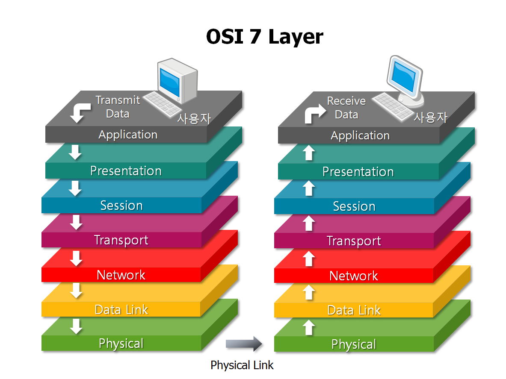
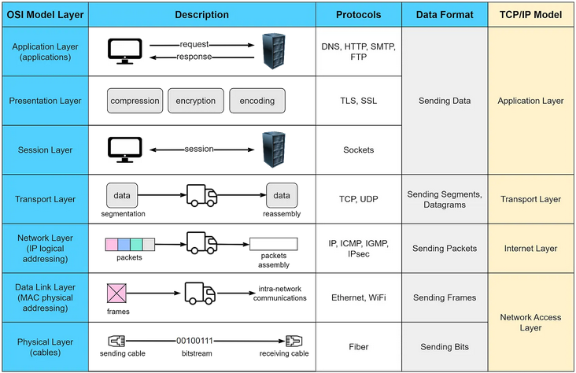

# OSI Model

<mark style="color:red;">**OSI (Open Systems Interconnection)**</mark> model is a conceptual <mark style="color:purple;">**framework**</mark> that standardizes the functions of a telecommunications or networking system into seven distinct layers:

1. <mark style="color:yellow;">**`Physical Layer`**</mark>: This layer deals with the physical medium and hardware aspects of data transmission, such as cables, switches, and electrical signals.
2. <mark style="color:yellow;">**`Data Link Layer`**</mark>: Responsible for the reliable transmission of data over a physical medium, it handles tasks like addressing, error detection, and framing.
3. <mark style="color:yellow;">**`Network Layer`**</mark>: Focuses on routing and forwarding data packets between different networks, often using logical addressing (like IP addresses).
4. <mark style="color:yellow;">**`Transport Layer`**</mark>: Ensures end-to-end data transfer reliability and provides services like flow control, error detection and correction, and data segmentation.
5. <mark style="color:yellow;">**`Session Layer`**</mark>: Manages the establishment, maintenance, and termination of communication sessions between devices, allowing for synchronization and organization of data exchange.
6. <mark style="color:yellow;">**`Presentation Layer`**</mark>: Responsible for data translation, encryption, and compression, making sure data is in a format that can be understood by both sender and receiver.
7. <mark style="color:yellow;">**`Application Layer`**</mark>: This is the topmost layer that interacts with end-user applications and provides network services like email, web browsing, and file transfer.

_But I think in this topic pictures are better explainers:_&#x20;

<figure><figcaption></figcaption></figure>

<figure><figcaption></figcaption></figure>
