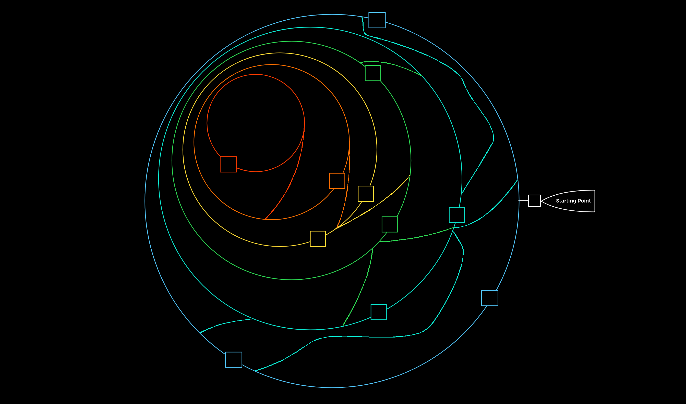

# Recon

***

### <mark style="color:yellow;">Our goal is not to get at the systems but to find all the ways to get there.</mark>

***

**To do proper reconnnaissance we should use three principles:**

1. <mark style="color:blue;">**There is more than meets the eye. Consider all points of view.**</mark>
2. <mark style="color:blue;">**Distinguish between what we see and what we do not see.**</mark>
3. <mark style="color:blue;">**There are always ways to gain more information. Understand the target.**</mark>

### Methodology

This methodology of footprinting is nested in 6 layers and represents, metaphorically speaking, boundaries that we try to pass with the enumeration process. The whole enumeration process is divided into three different levels:

* Infrastructure-based enumeration
* Host-based enumeration
* OS-based enumeration  So basically our hacking process should look like this (squares is our gaps in security):  Let's look more about our goals in each layer of this labyrinth:

<figure><figcaption><p>Recon scheme</p></figcaption></figure>

So basically our hacking process should look like this (squares is our gaps in security):

<figure><figcaption><p>Recon labyrinth</p></figcaption></figure>

* Layer 1: **Internet Presence** <mark style="color:blue;">`The goal of this layer is to identify all possible target systems and interfaces that can be tested.`</mark>
* Layer 2: **Gateway** <mark style="color:blue;">`The goal is to understand what we are dealing with and what we have to watch out for.`</mark>
* Layer 3: **Accessible Services** <mark style="color:blue;">`This layer aims to understand the reason and functionality of the target system and gain the necessary knowledge to communicate with it and exploit it for our purposes effectively.`</mark>
* Layer 4: **Processes** <mark style="color:blue;">`The goal here is to understand these factors and identify the dependencies between them.`</mark>
* Layer 5: **Privileges** <mark style="color:blue;">`It is crucial to identify these and understand what is and is not possible with these privileges.`</mark>
* Layer 6: **OS Setup** <mark style="color:blue;">`The goal here is to see how the administrators manage the systems and what sensitive internal information we can glean from them.`</mark>

## Domain Information

The first point of presence on the Internet may be the SSL certificate from the company's main website that we can examine. Often, such a certificate includes more than just a subdomain, and this means that the certificate is used for several domains, and these are most likely still active. You could look for subdomains and certificates in [crt.sh](https://crt.sh/) website, or try to use command:

```bash
curl -s https://crt.sh/\?q\=inlanefreight.com\&output\=json | jq . | grep name | cut -d":" -f2 | grep -v "CN=" | cut -d'"' -f2 | awk '{gsub(/\\n/,"\n");}1;' | sort -u
```

Also we could use shodan, but for this we need to pay some money for subscription or API usage, so we'll miss that part. The other part we could gather info about is DNS Records by using as example

```bash
dig any inlanefreight.com
```

## Subdomain and Directory Enum

* **Gobuster DNS**

```bash
gobuster dns -d superkek.com -w /usr/share/seclists/Discovery/DNS/subdomains-top1million-20000.txt -t 20
```

* **Gobuster VHOST**

```bash
gobuster vhost -u superkek.com -w /usr/share/seclists/Discovery/DNS/subdomains-top1million-5000.txt
```

* **Dirsearch**

```bash
dirsearch -u superkek.com
```

* **Ffuf Subdomain**

```bash
ffuf -w wordlist.txt:FUZZ -u https://FUZZ.superkek.com/`
```

* **Ffuf VHost**

```bash
ffuf -w wordlist.txt:FUZZ -u http://superkek.com:PORT/ -H 'Host: FUZZ.superkek.com' -fs xxx
```

## Port Scanning

For port scanning we could use [**nmap**](../../tools/nmap.md), or **rustscan**, or some custom scripts for less detection.&#x20;

### RustScan

That's a very fast port scanner written in Rust.

| Command                                      | Description                     |
| -------------------------------------------- | ------------------------------- |
| `rustscan -a www.amogus.kek`                 | Host Scanning                   |
| `rustscan -a www.amogus.kek -p 443`          | Individual Port Scanning        |
| `rustscan -a www.amogus.kek -p 443,80,22,21` | Multiple selected port scanning |
| `rustscan -a www.amogus.kek --range 1-1000`  | Ranges of ports                 |

### Wordlists

| **Command**                                                               | **Description**         |
| ------------------------------------------------------------------------- | ----------------------- |
| `/opt/useful/SecLists/Discovery/Web-Content/directory-list-2.3-small.txt` | Directory/Page Wordlist |
| `/opt/useful/SecLists/Discovery/Web-Content/web-extensions.txt`           | Extensions Wordlist     |
| `/opt/useful/SecLists/Discovery/DNS/subdomains-top1million-5000.txt`      | Domain Wordlist         |
| `/opt/useful/SecLists/Discovery/Web-Content/burp-parameter-names.txt`     | Parameters Wordlist     |

### Misc

| **Command**                                                                                                                   | **Description**          |
| ----------------------------------------------------------------------------------------------------------------------------- | ------------------------ |
| `sudo sh -c 'echo "SERVER_IP academy.htb" >> /etc/hosts'`                                                                     | Add DNS entry            |
| `for i in $(seq 1 1000); do echo $i >> ids.txt; done`                                                                         | Create Sequence Wordlist |
| `curl http://admin.academy.htb:PORT/admin/admin.php -X POST -d 'id=key' -H 'Content-Type: application/x-www-form-urlencoded'` | curl w/ POST             |
