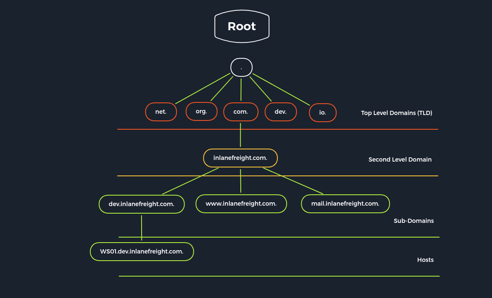

# DNS

**Domain Name System (DNS) is an integral part of the Internet. For example, through domain names, such as academy.hackthebox.com or www.hackthebox.com, we can reach the web servers that the hosting provider has assigned one or more specific IP addresses.** DNS is a system for resolving computer names into IP addresses, and it does not have a central database. The configuration files are usually : `named.conf.local`, `named.conf.options`, `named.conf.log`

<figure><figcaption><p>&#x3C;3</p></figcaption></figure>

| Server Type                    | Description                                                                                                                                                                                                                                                                                                                                                                                                                                                  |
| ------------------------------ | ------------------------------------------------------------------------------------------------------------------------------------------------------------------------------------------------------------------------------------------------------------------------------------------------------------------------------------------------------------------------------------------------------------------------------------------------------------ |
| `DNS Root Server`              | The root servers of the DNS are responsible for the top-level domains (`TLD`). As the last instance, they are only requested if the name server does not respond. Thus, a root server is a central interface between users and content on the Internet, as it links domain and IP address. The Internet Corporation for Assigned Names and Numbers (`ICANN`) coordinates the work of the root name servers. There are 13 such root servers around the globe. |
| `Authoritative Nameserver`     | Authoritative name servers hold authority for a particular zone. They only answer queries from their area of responsibility, and their information is binding. If an authoritative name server cannot answer a client's query, the root name server takes over at that point.                                                                                                                                                                                |
| `Non-authoritative Nameserver` | Non-authoritative name servers are not responsible for a particular DNS zone. Instead, they collect information on specific DNS zones themselves, which is done using recursive or iterative DNS querying.                                                                                                                                                                                                                                                   |
| `Caching DNS Server`           | Caching DNS servers cache information from other name servers for a specified period. The authoritative name server determines the duration of this storage.                                                                                                                                                                                                                                                                                                 |
| `Forwarding Server`            | Forwarding servers perform only one function: they forward DNS queries to another DNS server.                                                                                                                                                                                                                                                                                                                                                                |
| `Resolver`                     | Resolvers are not authoritative DNS servers but perform name resolution locally in the computer or router.                                                                                                                                                                                                                                                                                                                                                   |

#### There are many useful and not DNS records:

* `A`: Returns an IPv4 address of the requested domain as a result.
* `AAAA`: Returns an IPv6 address of the requested domain.
* `MX`: Returns the responsible mail servers as a result.
* `NS`: Returns the DNS servers (nameservers) of the domain.
* `TXT`: this type of record often contains verification keys for different third-party providers and other security aspects of DNS
* `CNAME`: This record serves as an alias.
* `PRT`: The PTR record works the other way around (reverse lookup). It converts IP addresses into valid domain names.
* `SOA`: Provides information about the corresponding DNS zone and email address of the administrative contact.

### Zone Files

**A DNS zone is a portion of the DNS namespace that a specific organization or administrator manages. Since DNS comprises multiple DNS zones, DNS servers utilize DNS zone transfers to copy a portion of their database to another DNS server. Unless a DNS server is configured correctly (limiting which IPs can perform a DNS zone transfer), anyone can ask a DNS server for a copy of its zone information since DNS zone transfers do not require any authentication.** For the IP address to be resolved from the **Fully Qualified Domain Name (`FQDN`)**, the DNS server must have a reverse lookup file. In this file, the computer name (FQDN) is assigned to the last octet of an IP address, which corresponds to the respective host, using a PTR record.

### Zone Transfer

`Zone transfer` refers to the transfer of zones to another server in DNS, which generally happens over TCP port 53. This procedure is abbreviated **Asynchronous Full Transfer Zone** (`AXFR`). Since a DNS failure usually has severe consequences for a company, the zone file is almost invariably kept identical on several name servers. When changes are made, it must be ensured that all servers have the same data. Synchronization between the servers involved is realized by zone transfer. A DNS server that serves as a direct source for synchronizing a zone file is called a master. A DNS server that obtains zone data from a master is called a slave.

### Tips2Hack

1. DIG - NS Query

```bash
dig ns inlanefreight.kek @13.13.13.13
```

2. DIG - Version Query

```bash
dig CH TXT version.bind 13.13.13.13
```

3. DIG - ANY Query

```bash
dig any inlanefreight.kek @13.13.13.13
```

4. DIG - AXFR Zone Transfer

```bash
dig axfr inlanefreight.kek @13.13.13.13
```

5. DIG - AXFR Zone Transfer - Internal

```bash
dig axfr internal.inlanefreight.kek @13.13.13.13
```

6. DNSEnum

```bash
dnsenum --dnsserver 13.13.13.13 --enum -p 0 -s 0 -o subdomains.txt -f /opt/useful/SecLists/Discovery/DNS/subdomains-top1million-110000.txt inlanefreight.kek
```
