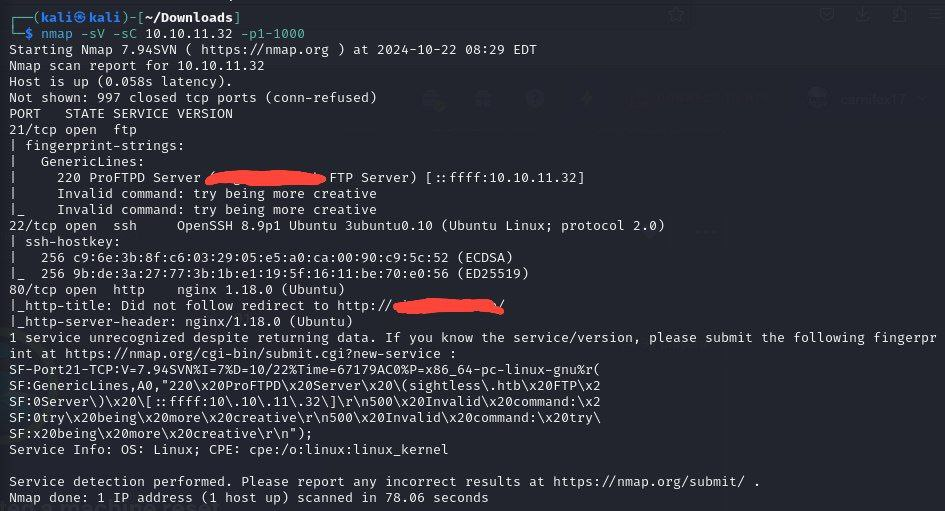

# Nmap

## About

Nmap is a complex port-scanning tool which is very often used by security specialists. It's more complex that ncat so in some ways sysadmins or programmers could use them to check hosts and port available.

<figure><figcaption>
Basic nmap version+script scanning
</figcaption></figure>

And it's a lot more complex than other tool ncat, which we can use for port-scanning purposes too

<figure><figcaption>
basic netcat port check/scan
</figcaption></figure>

## CheatSheet

| Option             | Description                                                         |
| ------------------ | ------------------------------------------------------------------- |
| 10.10.10.0/24      | Target network range.                                               |
| -sn                | Disables port scanning.                                             |
| -Pn                | Disables ICMP Echo Requests.                                        |
| -n                 | Disables DNS Resolution.                                            |
| -PE                | Performs the ping scan using ICMP Echo Requests against the target. |
| --packet-trace     | Shows all packets sent and received.                                |
| --reason           | Displays the reason for a specific result.                          |
| --disable-arp-ping | Disables ARP Ping Requests.                                         |
| --top-ports=\<num> | Scans the specified top ports defined as most frequent.             |
| -p-                | Scan all ports.                                                     |
| -p22-110           | Scan all ports between 22 and 110.                                  |
| -p22,25            | Scans only the specified ports 22 and 25.                           |
| -F                 | Scans top 100 ports.                                                |
| -sS                | Performs a TCP SYN-Scan.                                            |
| -sA                | Performs a TCP ACK-Scan.                                            |
| -sU                | Performs a UDP Scan.                                                |
| -sV                | Scans the discovered services for their versions.                   |
| -sC                | Perform a Script Scan with scripts categorized as "default".        |
| --script=\<script> | Performs a Script Scan using the specified scripts.                 |
| -O                 | Performs an OS Detection Scan to determine the OS of the target.    |
| -A                 | Performs OS Detection, Service Detection, and traceroute scans.     |
| -D RND:5           | Sets the number of random Decoys used to scan the target.           |
| -e                 | Specifies the network interface used for the scan.                  |
| -S 10.10.10.200    | Specifies the source IP address for the scan.                       |
| -g                 | Specifies the source port for the scan.                             |
| --dns-server \<ns> | DNS resolution is performed using a specified name server.          |

### Output Options

| Option       | Description                                                                    |
| ------------ | ------------------------------------------------------------------------------ |
| -oA filename | Stores the results in all available formats starting with the name "filename". |
| -oN filename | Stores the results in normal format with the name "filename".                  |
| -oG filename | Stores the results in "grepable" format with the name "filename".              |
| -oX filename | Stores the results in XML format with the name "filename".                     |

### Performance Options

| Option                     | Description                                                  |
| -------------------------- | ------------------------------------------------------------ |
| --max-retries \<num>       | Sets the number of retries for scans of specific ports.      |
| --stats-every=5s           | Displays the scan's status every 5 seconds.                  |
| -v/-vv                     | Displays verbose output during the scan.                     |
| --initial-rtt-timeout 50ms | Sets the specified time value as the initial RTT timeout.    |
| --max-rtt-timeout 100ms    | Sets the specified time value as the maximum RTT timeout.    |
| --min-rate 300             | Sets the number of packets that will be sent simultaneously. |
| -T <0-5>                   | Specifies the specific timing template.                      |
