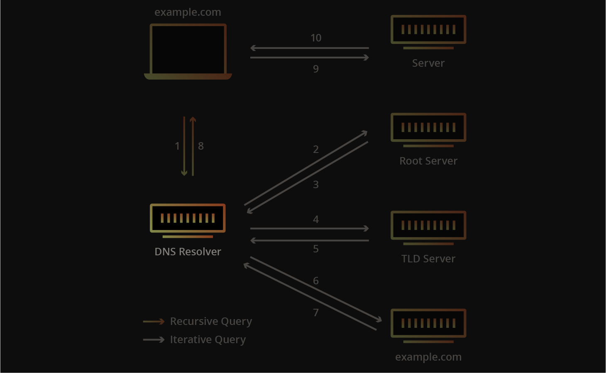

# DNS

## About

<mark style="color:red;">**Domain Name System (DNS)**</mark> is an integral <mark style="color:purple;">**part of the Internet**</mark>**.** For example, through domain names, such as <mark style="color:green;">**carnifex17.gitbook.io**</mark> or <mark style="color:green;">**www.google.com**</mark>, we can reach the web servers that the hosting provider has assigned one or more specific IP addresses. **DNS** is a system for resolving computer names into IP addresses, and it does not have a central database. The configuration files are usually : <mark style="color:green;">`named.conf.local`</mark>, <mark style="color:green;">`named.conf.options`</mark>, <mark style="color:green;">`named.conf.log`</mark>. DNS commonly is used by <mark style="color:yellow;">**UDP port 53**</mark>, or TCP if UDP isn't accessible.

## Server Types

***

<figure><figcaption><p>Image from here <a href="https://www.cloudflare.com/learning/dns/dns-server-types/"><strong>[LINK]</strong></a></p></figcaption></figure>

#### <mark style="color:blue;">DNS Root Server</mark>

<mark style="color:red;">**Root servers**</mark> of the DNS are responsible for the <mark style="color:yellow;">**top-level domains (TLD)**</mark>. As the last instance, they are only requested if the name server does not respond. Thus, a root server is a central interface between users and content on the Internet, as it links domain and IP address. <mark style="color:yellow;">**The Internet Corporation for Assigned Names and Numbers (ICANN)**</mark> coordinates the work of the root name servers. There are <mark style="color:yellow;">**13**</mark> such root servers around the globe.

#### <mark style="color:blue;">Authoritative Nameserver</mark>

<mark style="color:red;">**Authoritative nameservers**</mark> hold authority for a particular zone. They only answer queries from their area of responsibility, and their information is binding. If an authoritative name server cannot answer a client's query, the root name server takes over at that point.

#### <mark style="color:blue;">Non-Authoritative Nameserver</mark>

<mark style="color:red;">**Non-authoritative nameservers**</mark> are not responsible for a particular **DNS** zone. Instead, they collect information on specific **DNS** zones themselves, which is done using recursive or iterative **DNS** querying.

#### <mark style="color:blue;">Caching DNS Server</mark>

<mark style="color:red;">**Caching DNS servers**</mark> cache information from other name servers for a specified period. The authoritative name server determines the duration of this storage.

#### <mark style="color:blue;">Forwarding Server</mark>

<mark style="color:red;">**Forwarding servers**</mark> perform only one function: they forward DNS queries to another DNS server.

#### <mark style="color:blue;">Resolver</mark>

<mark style="color:red;">**Resolvers**</mark> are not authoritative **DNS** servers but perform name resolution locally in the computer or router.

***

## DNS Records Types

#### There are many useful and not DNS records:

* <mark style="color:green;">**`A`**</mark>: Returns an **IPv4** address of the requested domain as a result.
* <mark style="color:green;">**`AAAA`**</mark>: Returns an **IPv6** address of the requested domain.
* <mark style="color:green;">**`MX`**</mark>: Returns the responsible mail servers as a result.
* <mark style="color:green;">**`NS`**</mark>: Returns the **DNS** servers (nameservers) of the domain.
* <mark style="color:green;">**`TXT`**</mark>: this type of record often contains verification keys for different third-party providers and other security aspects of **DNS**
* <mark style="color:green;">**`CNAME`**</mark>: This record serves as an alias.
* <mark style="color:green;">**`PTR`**</mark>: The **PTR** record works the other way around (reverse lookup). It converts IP addresses into valid domain names.
* <mark style="color:green;">**`SOA`**</mark>: Provides information about the corresponding **DNS** zone and email address of the administrative contact.

## Zone Files

<mark style="color:red;">**DNS zone**</mark> is a <mark style="color:purple;">**section**</mark> of the **DNS** namespace managed by an **organization** or **administrator**. **DNS** servers use zone transfers to share parts of their database with other servers. If not properly configured to limit which IPs can perform transfers, anyone can request zone data, as zone transfers usually lack authentication. To resolve an IP address from an <mark style="color:yellow;">**Fully Qualified Domain Name (FQDN)**</mark>, the **DNS** server relies on a reverse lookup file, which uses **PTR records** to link the hostname of computer **(FQDN)** to the last octet of the corresponding IP address.

## Zone Transfer

<mark style="color:red;">**Zone transfer**</mark> refers to the transfer of zones to another server in DNS, which generally happens over TCP port <mark style="color:yellow;">**53**</mark>. This procedure is abbreviated <mark style="color:yellow;">**Asynchronous Full Transfer Zone (AXFR).**</mark> Since a **DNS** failure usually has severe consequences for a company, the zone file is almost invariably kept identical on several name servers. When changes are made, it must be ensured that <mark style="color:purple;">**all servers have the same data**</mark>. Synchronization between the servers involved is realized by **zone transfer**. Direct source for synchronizing a zone file is called a <mark style="color:yellow;">**master**</mark>. A **DNS** server that obtains zone data from a master is called a <mark style="color:yellow;">**slave**</mark>.&#x20;

## DNS Spoofing

<mark style="color:red;">**DNS Spoofing**</mark> or also <mark style="color:red;">**DNS Cache Poisoning**</mark> is attack, which involves poisoning target's DNS Records and using it for our purpose like MiTM, Overtaking control of the server, redirecting to false website for phishing.

### Ettercap

We could use <mark style="color:red;">**Ettercap**</mark> [**\[LINK\]**](https://www.ettercap-project.org/) tool for DNS Spoofing.&#x20;

First we need to edit <mark style="color:green;">`/etc/ettercap/etter.dns`</mark> and add there are target domain name and our <mark style="color:purple;">**(attacker)**</mark> IP address to which we want our **prey** be redirected to:

```
amogus.com      A   13.13.13.13
*.amogus.com    A   13.13.13.13
```

Then we are turning on **Ettercap** and scanning for hosts by <mark style="color:green;">**`Hosts > Scan for Hosts`**</mark>. Then adding target IP to <mark style="color:yellow;">**Target1**</mark> and **default getaway** to <mark style="color:yellow;">**Target2**</mark>. Then we should activate <mark style="color:green;">**dns\_spoof**</mark> module in <mark style="color:green;">**`Plugins > Manage Plugins`**</mark>. If everything done right, target from <mark style="color:yellow;">**Target1**</mark> machine should be redirected to <mark style="color:yellow;">**13.13.13.13**</mark> host.

### Bettercap

We could use <mark style="color:red;">**Bettercap**</mark> [**\[LINK\]**](https://www.bettercap.org/) **for same purpose.**

```bash
set dns.spoof.domains website.com; set dns.spoof.address 13.13.13.13; dns.spoof on
```

This command is three commands in one with **semicolon** as delimiter:

1. Setting up target domain:&#x20;
2. Setting up attacker IP address
3. Turning on spoofing

For multiple mappings you could make a **file**:

```bash
13.13.13.4 youtube.com
13.13.13.5 synacktiv.com
13.13.13.6 google.com
```

## DIG

<mark style="color:red;">**DIG (Domain Information Groper)**</mark> command is a powerful and flexible **DNS** lookup tool used for querying **DNS** servers.

#### **NS Query**

```bash
dig ns website.com @13.13.13.13
```

#### **Version Query**

```bash
dig CH TXT version.bind 13.13.13.13
```

#### **ANY Query**

```bash
dig any website.com @13.13.13.13
```

#### **AXFR Zone Transfer.**&#x20;

<mark style="color:green;">**"@"**</mark> symbol means domain <mark style="color:yellow;">**TO**</mark> which we are sending request. IP Without <mark style="color:green;">**"@"**</mark> means that's the domain we're asking <mark style="color:yellow;">**ABOUT**</mark>.

```bash
dig axfr website.com @13.13.13.13
```

#### **AXFR Zone Transfer - Internal**

```bash
dig axfr internal.website.com @13.13.13.13
```

## Tips2Hack

1. **Local** **CNAME Enum**

```
host subdomain.amogus.com
```

2. **DNSEnum**

```bash
dnsenum --dnsserver 13.13.13.13 --enum -p 0 -s 0 -o subdomains.txt -f /opt/useful/SecLists/Discovery/DNS/subdomains-top1million-110000.txt inlanefreight.kek
```

3. **Fierce** [**\[LINK\]**](https://github.com/mschwager/fierce)

```bash
fierce --domain zonetransfer.me
```

4. **Subfinder** [**\[LINK\]**](https://github.com/projectdiscovery/subfinder)

```bash
./subfinder -d amogus.com -v 
```

5. **Subbrute** [**\[LINK\]**](https://github.com/TheRook/subbrute)

```bash
./subbrute amogus.com -s ./names.txt -r ./resolvers.txt
```
