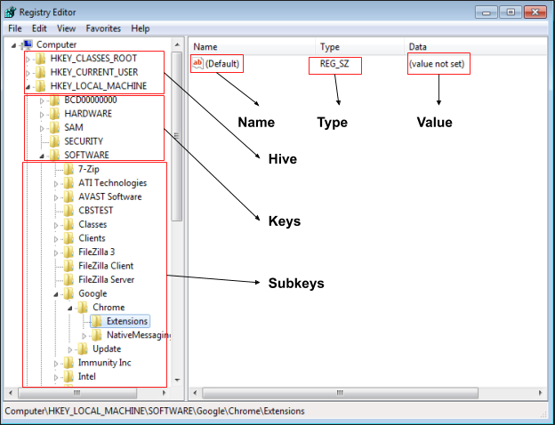
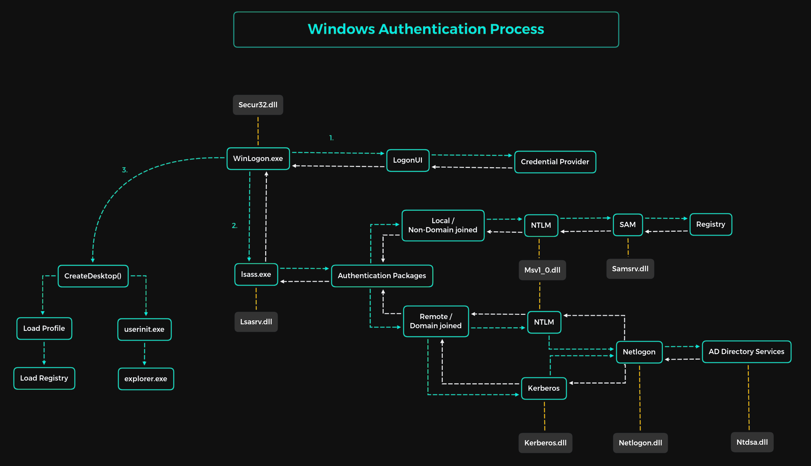

# Theory

## Windows Registry

**The Windows Registry is a collection of databases of configuration settings for Windows.** The Registry is a database of all the settings that the Microsoft Windows operating system, its applications, and hardware device drivers use to maintain their configurations. **The Registry** is a hierarchical database. At the top of the hierarchy is your **computer**. Under that, you’ll find the main branches, known as “<mark style="color:red;">**hives.**</mark>” Within these hives are <mark style="color:red;">**Registry keys**</mark><mark style="color:red;">.</mark> Keys can contain <mark style="color:red;">**sub-keys**</mark> and <mark style="color:red;">**Registry values**</mark><mark style="color:red;">.</mark>

<figure><figcaption>
Structure of Registry
</figcaption></figure>

### Important Registry Hives

| Registry Hive                                                     | What is                                                                                                        |
| ----------------------------------------------------------------- | -------------------------------------------------------------------------------------------------------------- |
| <mark style="color:blue;">**HKEY\_CLASSES\_ROOT (HKCR)**</mark>   | Information about registered applications, file associations, and OLE( Object Linking and Embedding ) objects. |
| <mark style="color:blue;">**HKEY\_CURRENT\_USER (HKCU)**</mark>   | Settings specific to the current user, such as desktop settings and application settings.                      |
| <mark style="color:blue;">**HKEY\_LOCAL\_MACHINE (HKLM)**</mark>  | System-wide settings, security policies, and hardware configurations that apply to all users.                  |
| <mark style="color:blue;">**HKEY\_USERS (HKU)**</mark>            | All user profiles loaded on the computer, including the current user's profile.                                |
| <mark style="color:blue;">**HKEY\_CURRENT\_CONFIG (HKCC)**</mark> | Information about the current hardware profile of the computer, such as display and printer settings.          |

### Important Registry Keys

| Registry Key                                                                                                         | What is                                                                       |
| -------------------------------------------------------------------------------------------------------------------- | ----------------------------------------------------------------------------- |
| <mark style="color:blue;">**HKEY\_LOCAL\_MACHINE\Security**</mark>                                                   | Security settings, such as account policies and security options.             |
| <mark style="color:blue;">**HKEY\_LOCAL\_MACHINE\Software\Microsoft\Windows\CurrentVersion\Run**</mark>              | List of programs that run automatically at startup.                           |
| <mark style="color:blue;">**HKEY\_LOCAL\_MACHINE\System\CurrentControlSet\Services**</mark>                          | Information about system services, including startup type and dependencies.   |
| <mark style="color:blue;">**HKEY\_CURRENT\_USER\Software\Microsoft\Windows\CurrentVersion\Internet Settings**</mark> | Internet Explorer settings, such as proxy settings and security zones.        |
| <mark style="color:blue;">**HKEY\_LOCAL\_MACHINE\Software\Microsoft\Windows NT\CurrentVersion\Windows**</mark>       | Windows configuration information, such as system name and installation path. |

## Windows Authentication Process

<figure><figcaption></figcaption></figure>

## SAM

<mark style="color:red;">**The Security Accounts Manager**</mark>** is a database file in the Microsoft Windows operating system that contains usernames and passwords.** The SAM is available in different versions of Windows, including XP, Vista, 7, 8.1, 10 and 11. Each user account can be assigned a local area network (LAN) and a password would be hashed and stored in the SAM. The passwords hashes are stored in <mark style="color:blue;">**HKEY\_LOCAL\_MACHINE\SAM,**</mark> but the access to it is restricted. **HKLM/SAM** and **SYSTEM** privileges are required for accessing it.

## LSASS

<mark style="color:red;">**Local Security Authority Subsystem Service (LSASS)**</mark> is a collection of many modules and has access to all authentication processes that can be found in <mark style="color:blue;">**`%SystemRoot%\System32\Lsass.exe`**</mark>. This service is responsible for the local system security policy, user authentication, and sending security audit logs to the Event Log.

### LSA Secrets

LSA Secrets are sensitive data stored by the **Local Security Authority** (LSA) on Windows systems.&#x20;

This data is stored in the Windows Registry at <mark style="color:blue;">**`HKEY_LOCAL_MACHINE\Security\Policy\Secrets`**</mark>

## DPAPI

<mark style="color:red;">**Data Protection Application Programming Interface**</mark> is set of API which Windows uses for the symmetric encryption of asymmetric private keys and used by various third-party applications like:

* **Internet Explorer**
* **Google Chrome**
* **Outlook**
* **Remote Desktop Connection**
* **Credential Manager**

## NTLM

***

## Important Files Location

* _<mark style="color:green;">**C:\Windows\System32\drivers\etc**</mark> - **Local DNS file, same role as Linux /etc/hosts**_

